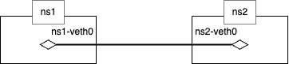

# ip link

## description
The `ip link` command (alias `ip l`) is part of the iproute2 suite for viewing and configuring network interfaces at the link layer via the Linux kernel’s Netlink interface. It can list all interfaces, show their state and attributes (flags, MTU, MAC address), and modify them (bring up/down, rename, set MTU, change MAC).

Common operations:
- `ip link show [dev <iface>]`: display all or specific interface details.
- `ip link set <iface> up|down`: enable or disable an interface.
- `ip link set <iface> mtu <size>`: adjust the MTU.
- `ip link set <iface> address <MAC>`: change the hardware (MAC) address.
- `ip link add <iface> type <type> [options]`: create virtual interfaces (veth, bridge, bond, etc.).
- `ip link del <iface>`: remove a virtual interface.

## example
1. Create Network Namespace
```
$ sudo ip netns add ns1
$ sudo ip netns add ns2
```

2. Create veth(Virtual Ethernet Device)
```
$ sudo ip link add ns1-veth0 type veth peer name ns2-veth0
$ ip link show | grep veth
8: ns2-veth0@ns1-veth0: <BROADCAST,MULTICAST,M-DOWN> mtu 1500 qdisc noop state DOWN mode DEFAULT group default qlen 1000
9: ns1-veth0@ns2-veth0: <BROADCAST,MULTICAST,M-DOWN> mtu 1500 qdisc noop state DOWN mode DEFAULT group default qlen 1000
```

3. Attach veth on Network Namespace
```
$ sudo ip link set ns1-veth0 netns ns1
$ sudo ip link set ns2-veth0 netns ns2
$ ip link show | grep veth
$ sudo ip netns exec ns1 ip link show | grep veth
9: ns1-veth0@if8: <BROADCAST,MULTICAST> mtu 1500 qdisc noop state DOWN mode DEFAULT group default qlen 1000
$ sudo ip netns exec ns2 ip link show | grep veth
8: ns2-veth0@if9: <BROADCAST,MULTICAST> mtu 1500 qdisc noop state DOWN mode DEFAULT group default qlen 1000
```



4. Set IP address on each veth
```
$ sudo ip netns exec ns1 ip address add 192.0.2.1/24 dev ns1-veth0
$ sudo ip netns exec ns2 ip address add 192.0.2.2/24 dev ns2-veth0
```

5. Set veth's state UP
```
$ sudo ip netns exec ns1 ip link show ns1-veth0 | grep state
9: ns1-veth0@if8: <BROADCAST,MULTICAST> mtu 1500 qdisc noop state DOWN mode DEFAULT group default qlen 1000
$ sudo ip netns exec ns2 ip link show ns2-veth0 | grep state
8: ns2-veth0@if9: <BROADCAST,MULTICAST> mtu 1500 qdisc noop state DOWN mode DEFAULT group default qlen 1000

$ sudo ip netns exec ns1 ip link set ns1-veth0 up
$ sudo ip netns exec ns2 ip link set ns2-veth0 up

$ sudo ip netns exec ns1 ip link show ns1-veth0 | grep state
9: ns1-veth0@if8: <BROADCAST,MULTICAST,UP,LOWER_UP> mtu 1500 qdisc noqueue state UP mode DEFAULT group default qlen 1000
$ sudo ip netns exec ns2 ip link show ns2-veth0 | grep state
8: ns2-veth0@if9: <BROADCAST,MULTICAST,UP,LOWER_UP> mtu 1500 qdisc noqueue state UP mode DEFAULT group default qlen 1000
```

6. Check Connection
```
$ sudo ip netns exec ns1 ping -c 3 192.0.2.2
PING 192.0.2.2 (192.0.2.2) 56(84) bytes of data.
64 bytes from 192.0.2.2: icmp_seq=1 ttl=64 time=0.071 ms
64 bytes from 192.0.2.2: icmp_seq=2 ttl=64 time=0.034 ms
64 bytes from 192.0.2.2: icmp_seq=3 ttl=64 time=0.037 ms

--- 192.0.2.2 ping statistics ---
3 packets transmitted, 3 received, 0% packet loss, time 2051ms
rtt min/avg/max/mdev = 0.034/0.047/0.071/0.016 ms
```


