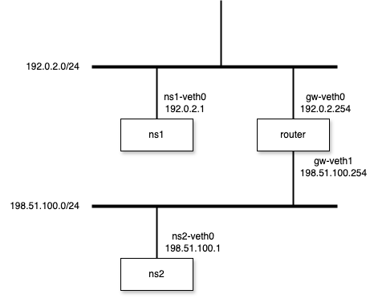

# router

## example



1. Create Network Namespaces
```bash
$ sudo ip netns add ns1
$ sudo ip netns add router
$ sudo ip netns add ns2
$ sudo ip netns show
ns1
router
ns2
```

2. Create veth interfaces
```bash
$ sudo ip link add ns1-veth0 type veth peer name gw-veth0
$ sudo ip link add ns2-veth0 type veth peer name gw-veth1
```

3. Attach veth interfaces on Network Namespaces
```bash
$ sudo ip link set ns1-veth0 netns ns1
$ sudo ip link set gw-veth0 netns router
$ sudo ip link set gw-veth1 netns router
$ sudo ip link set ns2-veth0 netns ns2
```

4. Set the state of veth interfaces UP
```bash
$ sudo ip netns exec ns1 ip link set ns1-veth0 up
$ sudo ip netns exec router ip link set gw-veth0 up
$ sudo ip netns exec router ip link set gw-veth1 up
$ sudo ip netns exec ns2 ip link set ns2-veth0 up
```

5. Allocate IP Addresses
```bash
$ sudo ip netns exec ns1 ip address add 192.0.2.1/24 dev ns1-veth0
$ sudo ip netns exec router ip address add 192.0.2.254/24 dev gw-veth0

$ sudo ip netns exec router ip address add 198.51.100.254/24 dev gw-veth1
$ sudo ip netns exec ns2 ip address add 198.51.100.1/24 dev ns2-veth0
```

6. Check the connection of each namespace to the router

`ns1 <-> router`
```bash
$ sudo ip netns exec ns1 ping -c 3 192.0.2.254 -I 192.0.2.1
PING 192.0.2.254 (192.0.2.254) from 192.0.2.1 : 56(84) bytes of data.
64 bytes from 192.0.2.254: icmp_seq=1 ttl=64 time=0.075 ms
64 bytes from 192.0.2.254: icmp_seq=2 ttl=64 time=0.035 ms
64 bytes from 192.0.2.254: icmp_seq=3 ttl=64 time=0.021 ms

--- 192.0.2.254 ping statistics ---
3 packets transmitted, 3 received, 0% packet loss, time 2047ms
rtt min/avg/max/mdev = 0.021/0.043/0.075/0.022 ms
```

`ns2 <-> router`
```bash
$ sudo ip netns exec ns2 ping -c 3 198.51.100.254 -I 198.51.100.1
PING 198.51.100.254 (198.51.100.254) from 198.51.100.1 : 56(84) bytes of data.
64 bytes from 198.51.100.254: icmp_seq=1 ttl=64 time=0.041 ms
64 bytes from 198.51.100.254: icmp_seq=2 ttl=64 time=0.038 ms
64 bytes from 198.51.100.254: icmp_seq=3 ttl=64 time=0.037 ms

--- 198.51.100.254 ping statistics ---
3 packets transmitted, 3 received, 0% packet loss, time 2062ms
rtt min/avg/max/mdev = 0.037/0.038/0.041/0.001 ms
```

7. Check the connection of each namespace through the router (failed)
```bash
$ sudo ip netns exec ns1 ping -c 3 198.51.100.1 -I 192.0.2.1
PING 198.51.100.1 (198.51.100.1) from 192.0.2.1 : 56(84) bytes of data.

--- 198.51.100.1 ping statistics ---
3 packets transmitted, 0 received, 100% packet loss, time 2070ms
```

8. Add default route to each namespace

`Before`
```bash
$ sudo ip netns exec ns1 ip route show
192.0.2.0/24 dev ns1-veth0 proto kernel scope link src 192.0.2.1
$ sudo ip netns exec ns2 ip route show
198.51.100.0/24 dev ns2-veth0 proto kernel scope link src 198.51.100.1
```

`Add`
```bash
$ sudo ip netns exec ns1 ip route add default via 192.0.2.254
$ sudo ip netns exec ns2 ip route add default via 198.51.100.254
```

`After`
```bash
$ sudo ip netns exec ns1 ip route show
default via 192.0.2.254 dev ns1-veth0
192.0.2.0/24 dev ns1-veth0 proto kernel scope link src 192.0.2.1
$ sudo ip netns exec ns2 ip route show
default via 198.51.100.254 dev ns2-veth0
198.51.100.0/24 dev ns2-veth0 proto kernel scope link src 198.51.100.1
```

9. Check the connection of each namespace through the router again
```bash
$ sudo ip netns exec ns1 ping -c 3 198.51.100.1 -I 192.0.2.1
PING 198.51.100.1 (198.51.100.1) from 192.0.2.1 : 56(84) bytes of data.
64 bytes from 198.51.100.1: icmp_seq=1 ttl=63 time=0.061 ms
64 bytes from 198.51.100.1: icmp_seq=2 ttl=63 time=0.049 ms
64 bytes from 198.51.100.1: icmp_seq=3 ttl=63 time=0.029 ms

--- 198.51.100.1 ping statistics ---
3 packets transmitted, 3 received, 0% packet loss, time 2058ms
rtt min/avg/max/mdev = 0.029/0.046/0.061/0.013 ms
```

> [!NOTE]
> The time you failed to transit, you may run this command to set karnel parameter.
>
> `sudo ip netns exec router sysctl net.ipv4.ip_forward=1`
