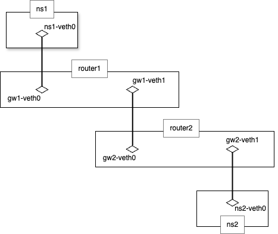
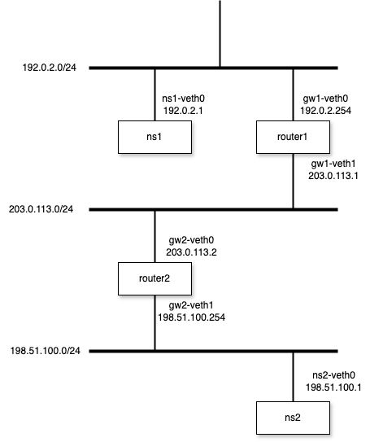

# multi router

## example





1. Create Network Namespaces
```bash
$ sudo ip netns add ns1
$ sudo ip netns add router1
$ sudo ip netns add router2
$ sudo ip netns add ns2
$ sudo ip netns show
ns1
router1
router2
ns2
```

2. Create veth interfaces
```bash
$ sudo ip link add ns1-veth0 type veth peer name gw1-veth0
$ sudo ip link add gw1-veth1 type veth peer name gw2-veth0
$ sudo ip link add gw2-veth1 type veth peer name ns2-veth0
```

3. Attach veth interfaces on Network Namespaces
```bash
$ sudo ip link set ns1-veth0 netns ns1
$ sudo ip link set gw1-veth0 netns router1
$ sudo ip link set gw1-veth1 netns router1
$ sudo ip link set gw2-veth0 netns router2
$ sudo ip link set gw2-veth1 netns router2
$ sudo ip link set ns2-veth0 netns ns2
```

4. Set the state of veth interfaces UP
```bash
$ sudo ip netns exec ns1 ip link set ns1-veth0 up
$ sudo ip netns exec router1 ip link set gw1-veth0 up
$ sudo ip netns exec router1 ip link set gw1-veth1 up
$ sudo ip netns exec router2 ip link set gw2-veth0 up
$ sudo ip netns exec router2 ip link set gw2-veth1 up
$ sudo ip netns exec ns2 ip link set ns2-veth0 up
```

5. Allocate IP Addresses
```bash
$ sudo ip netns exec ns1 ip address add 192.0.2.1/24 dev ns1-veth0

$ sudo ip netns exec router1 ip address add 192.0.2.254/24 dev gw1-veth0
$ sudo ip netns exec router1 ip address add 203.0.113.1/24 dev gw1-veth1

$ sudo ip netns exec router2 ip address add 203.0.113.2/24 dev gw2-veth0
$ sudo ip netns exec router2 ip address add 198.51.100.254/24 dev gw2-veth1

$ sudo ip netns exec ns2 ip address add 198.51.100.1/24 dev ns2-veth0
```

6. Check the connection of each node

`ns1 <-> router1`
```bash
$ sudo ip netns exec ns1 ping -c 3 192.0.2.254 -I 192.0.2.1
PING 192.0.2.254 (192.0.2.254) from 192.0.2.1 : 56(84) bytes of data.
64 bytes from 192.0.2.254: icmp_seq=1 ttl=64 time=0.074 ms
64 bytes from 192.0.2.254: icmp_seq=2 ttl=64 time=0.040 ms
64 bytes from 192.0.2.254: icmp_seq=3 ttl=64 time=0.031 ms

--- 192.0.2.254 ping statistics ---
3 packets transmitted, 3 received, 0% packet loss, time 2079ms
rtt min/avg/max/mdev = 0.031/0.048/0.074/0.018 ms
```

`router1 <-> router2`
```bash
$ sudo ip netns exec router1 ping -c 3 203.0.113.2 -I 203.0.113.1
PING 203.0.113.2 (203.0.113.2) from 203.0.113.1 : 56(84) bytes of data.
64 bytes from 203.0.113.2: icmp_seq=1 ttl=64 time=0.077 ms
64 bytes from 203.0.113.2: icmp_seq=2 ttl=64 time=0.042 ms
64 bytes from 203.0.113.2: icmp_seq=3 ttl=64 time=0.044 ms

--- 203.0.113.2 ping statistics ---
3 packets transmitted, 3 received, 0% packet loss, time 2078ms
rtt min/avg/max/mdev = 0.042/0.054/0.077/0.016 ms
```

`router2 <-> ns2`
```bash
$ sudo ip netns exec router2 ping -c 3 198.51.100.1 -I 198.51.100.254
PING 198.51.100.1 (198.51.100.1) from 198.51.100.254 : 56(84) bytes of data.
64 bytes from 198.51.100.1: icmp_seq=1 ttl=64 time=0.069 ms
64 bytes from 198.51.100.1: icmp_seq=2 ttl=64 time=0.036 ms
64 bytes from 198.51.100.1: icmp_seq=3 ttl=64 time=0.048 ms

--- 198.51.100.1 ping statistics ---
3 packets transmitted, 3 received, 0% packet loss, time 2041ms
rtt min/avg/max/mdev = 0.036/0.051/0.069/0.013 ms
```

7. Check the connection of each namespace through the router (failed)
```bash
$ sudo ip netns exec ns1 ping -c 3 198.51.100.1 -I 192.0.2.1
PING 198.51.100.1 (198.51.100.1) from 192.0.2.1 : 56(84) bytes of data.

--- 198.51.100.1 ping statistics ---
3 packets transmitted, 0 received, 100% packet loss, time 2031ms
```

8. Add default route to each namespace
```bash
$ sudo ip netns exec ns1 ip route add default via 192.0.2.254
$ sudo ip netns exec ns2 ip route add default via 198.51.100.254
```

9. Add diffrerent segment route to each router
```bash
$ sudo ip netns exec router1 ip route add 198.51.100.0/24 via 203.0.113.2
$ sudo ip netns exec router2 ip route add 192.0.2.0/24 via 203.0.113.1
```

10. Check the connection of each namespace through the router
```bash
$ sudo ip netns exec ns1 ping -c 3 198.51.100.1 -I 192.0.2.1
PING 198.51.100.1 (198.51.100.1) from 192.0.2.1 : 56(84) bytes of data.
64 bytes from 198.51.100.1: icmp_seq=1 ttl=62 time=0.073 ms
64 bytes from 198.51.100.1: icmp_seq=2 ttl=62 time=0.052 ms
64 bytes from 198.51.100.1: icmp_seq=3 ttl=62 time=0.032 ms

--- 198.51.100.1 ping statistics ---
3 packets transmitted, 3 received, 0% packet loss, time 2080ms
rtt min/avg/max/mdev = 0.032/0.052/0.073/0.016 ms
```
