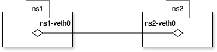
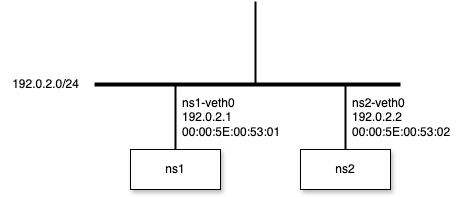

# MAC Address

## description

A MAC (Media Access Control) address is a 48-bit, link-layer identifier burned into (or assigned to) every Ethernet-capable network interface.  It operates at OSI Layer 2 to direct frames across a single network segment, and is expressed as six pairs of hexadecimal digits (for example, `00:1A:2B:3C:4D:5E`).  In most physical NICs it’s vendor-assigned, but Linux also allows you to override it at runtime.


## example
1. Create Network Namespace
```bash
$ sudo ip netns add ns1
$ sudo ip netns add ns2
```

2. Create veth
```bash
$ sudo ip link add ns1-veth0 type veth peer name ns2-veth0
$ ip link show | grep veth
20: ns2-veth0@ns1-veth0: <BROADCAST,MULTICAST,M-DOWN> mtu 1500 qdisc noop state DOWN mode DEFAULT group default qlen 1000
21: ns1-veth0@ns2-veth0: <BROADCAST,MULTICAST,M-DOWN> mtu 1500 qdisc noop state DOWN mode DEFAULT group default qlen 1000
```

3. Attach veth on Network Namespace
```bash
$ sudo ip link set ns1-veth0 netns ns1
$ sudo ip link set ns2-veth0 netns ns2
```



4. Set IP address on each veth
```bash
$ sudo ip netns exec ns1 ip address add 192.0.2.1/24 dev ns1-veth0
$ sudo ip netns exec ns2 ip address add 192.0.2.2/24 dev ns2-veth0
```

5. Set veth's state UP
```bash
$ sudo ip netns exec ns1 ip link set ns1-veth0 up
$ sudo ip netns exec ns2 ip link set ns2-veth0 up
```

6. Set MAC Address
```bash
$ sudo ip netns exec ns1 ip link set dev ns1-veth0 address 00:00:5E:00:53:01
$ sudo ip netns exec ns2 ip link set dev ns2-veth0 address 00:00:5E:00:53:02

$ sudo ip netns exec ns1 ip link show ns1-veth0 | grep link/ether
    link/ether 00:00:5e:00:53:01 brd ff:ff:ff:ff:ff:ff link-netns ns2
$ sudo ip netns exec ns2 ip link show ns2-veth0 | grep link/ether
    link/ether 00:00:5e:00:53:02 brd ff:ff:ff:ff:ff:ff link-netns ns1
```



7. Packet capturing

`tabA`
```bash
$ sudo ip netns exec ns1 tcpdump -tnel -i ns1-veth0 icmp
tcpdump: verbose output suppressed, use -v[v]... for full protocol decode
listening on ns1-veth0, link-type EN10MB (Ethernet), snapshot length 262144 bytes
```

`tabB`
```bash
$ sudo ip netns exec ns1 ping -c 3 192.0.2.2 -I 192.0.2.1
PING 192.0.2.2 (192.0.2.2) from 192.0.2.1 : 56(84) bytes of data.
64 bytes from 192.0.2.2: icmp_seq=1 ttl=64 time=0.082 ms
64 bytes from 192.0.2.2: icmp_seq=2 ttl=64 time=0.046 ms
64 bytes from 192.0.2.2: icmp_seq=3 ttl=64 time=0.040 ms

--- 192.0.2.2 ping statistics ---
3 packets transmitted, 3 received, 0% packet loss, time 2081ms
rtt min/avg/max/mdev = 0.040/0.056/0.082/0.018 ms
```

`tabA`
```bash
$ sudo ip netns exec ns1 tcpdump -tnel -i ns1-veth0 icmp
...

00:00:5e:00:53:01 > 00:00:5e:00:53:02, ethertype IPv4 (0x0800), length 98: 192.0.2.1 > 192.0.2.2: ICMP echo request, id 2323, seq 1, length 64
00:00:5e:00:53:02 > 00:00:5e:00:53:01, ethertype IPv4 (0x0800), length 98: 192.0.2.2 > 192.0.2.1: ICMP echo reply, id 2323, seq 1, length 64
00:00:5e:00:53:01 > 00:00:5e:00:53:02, ethertype IPv4 (0x0800), length 98: 192.0.2.1 > 192.0.2.2: ICMP echo request, id 2323, seq 2, length 64
00:00:5e:00:53:02 > 00:00:5e:00:53:01, ethertype IPv4 (0x0800), length 98: 192.0.2.2 > 192.0.2.1: ICMP echo reply, id 2323, seq 2, length 64
00:00:5e:00:53:01 > 00:00:5e:00:53:02, ethertype IPv4 (0x0800), length 98: 192.0.2.1 > 192.0.2.2: ICMP echo request, id 2323, seq 3, length 64
00:00:5e:00:53:02 > 00:00:5e:00:53:01, ethertype IPv4 (0x0800), length 98: 192.0.2.2 > 192.0.2.1: ICMP echo reply, id 2323, seq 3, length 64
```

> [!IMPORTANT]
> ARP (Address Resolution Protocol)
>
> ARP (Address Resolution Protocol) resolves IPv4 addresses to MAC addresses on the same Ethernet segment. When a host needs to send an IP packet but does not yet know the destination’s MAC, it broadcasts an ARP request (“Who has IP <dst>? Tell <src>”). The machine owning that IP replies with an ARP reply containing its MAC address. Linux caches these mappings in the ARP table (viewable via `ip neigh` or `arp -n`) and uses them to populate the Ethernet headers. You can also add or remove entries manually with `ip neigh`.

8. Reset cache of MAC Address
```bash
$ sudo ip netns exec ns1 ip neigh flush all
```

9. Packet capturing with ARP

`tabA`
```bash
$ sudo ip netns exec ns1 tcpdump -tnel -i ns1-veth0 icmp or arp
tcpdump: verbose output suppressed, use -v[v]... for full protocol decode
listening on ns1-veth0, link-type EN10MB (Ethernet), snapshot length 262144 bytes
```

`tabB`
```bash
$ sudo ip netns exec ns1 ping -c 3 192.0.2.2 -I 192.0.2.1
PING 192.0.2.2 (192.0.2.2) from 192.0.2.1 : 56(84) bytes of data.
64 bytes from 192.0.2.2: icmp_seq=1 ttl=64 time=0.077 ms
64 bytes from 192.0.2.2: icmp_seq=2 ttl=64 time=0.049 ms
64 bytes from 192.0.2.2: icmp_seq=3 ttl=64 time=0.036 ms

--- 192.0.2.2 ping statistics ---
3 packets transmitted, 3 received, 0% packet loss, time 2082ms
rtt min/avg/max/mdev = 0.036/0.054/0.077/0.017 ms
```

`tabA`
```bash
$ sudo ip netns exec ns1 tcpdump -tnel -i ns1-veth0 icmp or arp
...

00:00:5e:00:53:01 > ff:ff:ff:ff:ff:ff, ethertype ARP (0x0806), length 42: Request who-has 192.0.2.2 tell 192.0.2.1, length 28
00:00:5e:00:53:02 > 00:00:5e:00:53:01, ethertype ARP (0x0806), length 42: Reply 192.0.2.2 is-at 00:00:5e:00:53:02, length 28
00:00:5e:00:53:01 > 00:00:5e:00:53:02, ethertype IPv4 (0x0800), length 98: 192.0.2.1 > 192.0.2.2: ICMP echo request, id 2358, seq 1, length 64
00:00:5e:00:53:02 > 00:00:5e:00:53:01, ethertype IPv4 (0x0800), length 98: 192.0.2.2 > 192.0.2.1: ICMP echo reply, id 2358, seq 1, length 64
00:00:5e:00:53:01 > 00:00:5e:00:53:02, ethertype IPv4 (0x0800), length 98: 192.0.2.1 > 192.0.2.2: ICMP echo request, id 2358, seq 2, length 64
00:00:5e:00:53:02 > 00:00:5e:00:53:01, ethertype IPv4 (0x0800), length 98: 192.0.2.2 > 192.0.2.1: ICMP echo reply, id 2358, seq 2, length 64
00:00:5e:00:53:01 > 00:00:5e:00:53:02, ethertype IPv4 (0x0800), length 98: 192.0.2.1 > 192.0.2.2: ICMP echo request, id 2358, seq 3, length 64
00:00:5e:00:53:02 > 00:00:5e:00:53:01, ethertype IPv4 (0x0800), length 98: 192.0.2.2 > 192.0.2.1: ICMP echo reply, id 2358, seq 3, length 64
00:00:5e:00:53:02 > 00:00:5e:00:53:01, ethertype ARP (0x0806), length 42: Request who-has 192.0.2.1 tell 192.0.2.2, length 28
00:00:5e:00:53:01 > 00:00:5e:00:53:02, ethertype ARP (0x0806), length 42: Reply 192.0.2.1 is-at 00:00:5e:00:53:01, length 28
```

> [!NOTE]
> Before capturing ARP frames, we flush the ARP cache so that each IPv4 address must be re-resolved. In the tcpdump that follows, you’ll observe:
>
> 1. A broadcast ARP request (“Who has 192.0.2.2? Tell 192.0.2.1”) sent to ff:ff:ff:ff:ff:ff.
>
> 2. An ARP reply from 00:00:5e:00:53:02 announcing its MAC for 192.0.2.2.
>
> 3. Subsequent ICMP echo request/reply frames using the newly learned MAC addresses.
>
> 4. A reverse ARP request/reply at the end as ns2 refreshes its cache for 192.0.2.1.
