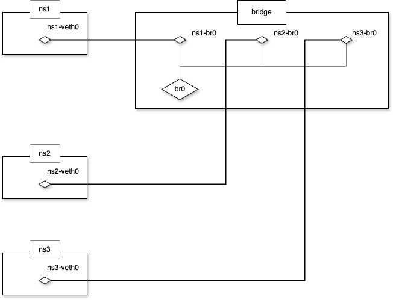
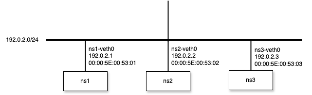

# bridge

## description

A network bridge is a software-based Layer 2 switch that forwards Ethernet frames between attached interfaces based on MAC-address learning. It allows multiple interfaces (physical, virtual, or veth peers) to share the same broadcast domain. When a frame arrives, the bridge inspects its source MAC to populate a forwarding database, then forwards unicast frames only to the port where the destination MAC was last seen, flooding unknown-destination and broadcast frames to all ports. In Linux, you create a bridge with:
```bash
ip link add dev br0 type bridge
ip link set br0 up
```
and enslave interfaces to it with:
```bash
ip link set <iface> master br0
```
This makes all attached namespaces or NICs behave as if they were plugged into the same Ethernet switch.

## example
1. Create Network Namespace
```bash
$ sudo ip netns add ns1
$ sudo ip netns add ns2
$ sudo ip netns add ns3
$ sudo ip netns add bridge
```

2. Create veth
```bash
$ sudo ip link add ns1-veth0 type veth peer name ns1-br0
$ sudo ip link add ns2-veth0 type veth peer name ns2-br0
$ sudo ip link add ns3-veth0 type veth peer name ns3-br0
```

3. Attach veth on Network Namespace
```bash
$ sudo ip link set ns1-veth0 netns ns1
$ sudo ip link set ns2-veth0 netns ns2
$ sudo ip link set ns3-veth0 netns ns3

$ sudo ip link set ns1-br0 netns bridge
$ sudo ip link set ns2-br0 netns bridge
$ sudo ip link set ns3-br0 netns bridge
```

4. Set veth's state UP
```bash
$ sudo ip netns exec ns1 ip link set ns1-veth0 up
$ sudo ip netns exec ns2 ip link set ns2-veth0 up
$ sudo ip netns exec ns3 ip link set ns3-veth0 up

$ sudo ip netns exec bridge ip link set ns1-br0 up
$ sudo ip netns exec bridge ip link set ns2-br0 up
$ sudo ip netns exec bridge ip link set ns3-br0 up
```



5. Set IP address on each veth
```bash
$ sudo ip netns exec ns1 ip address add 192.0.2.1/24 dev ns1-veth0
$ sudo ip netns exec ns2 ip address add 192.0.2.2/24 dev ns2-veth0
$ sudo ip netns exec ns3 ip address add 192.0.2.3/24 dev ns3-veth0
```

6. Set MAC Address
```bash
$ sudo ip netns exec ns1 ip link set dev ns1-veth0 address 00:00:5E:00:53:01
$ sudo ip netns exec ns2 ip link set dev ns2-veth0 address 00:00:5E:00:53:02
$ sudo ip netns exec ns3 ip link set dev ns3-veth0 address 00:00:5E:00:53:03
```

7. Create Network Bridge
```bash
$ sudo ip netns exec bridge ip link add dev br0 type bridge
$ sudo ip netns exec bridge ip link set br0 up
```

8. Attach Network Bridge to each veth
```bash
$ sudo ip netns exec bridge ip link set ns1-br0 master br0
$ sudo ip netns exec bridge ip link set ns2-br0 master br0
$ sudo ip netns exec bridge ip link set ns3-br0 master br0
```



9. Packet capturing

`ns1 <-> ns2`
```bash
$ sudo ip netns exec ns1 ping -c 3 192.0.2.2 -I 192.0.2.1
PING 192.0.2.2 (192.0.2.2) from 192.0.2.1 : 56(84) bytes of data.
64 bytes from 192.0.2.2: icmp_seq=1 ttl=64 time=0.113 ms
64 bytes from 192.0.2.2: icmp_seq=2 ttl=64 time=0.045 ms
64 bytes from 192.0.2.2: icmp_seq=3 ttl=64 time=0.026 ms

--- 192.0.2.2 ping statistics ---
3 packets transmitted, 3 received, 0% packet loss, time 2078ms
rtt min/avg/max/mdev = 0.026/0.061/0.113/0.037 ms
```

`ns1 <-> ns3`
```bash
$ sudo ip netns exec ns1 ping -c 3 192.0.2.3 -I 192.0.2.1
PING 192.0.2.3 (192.0.2.3) from 192.0.2.1 : 56(84) bytes of data.
64 bytes from 192.0.2.3: icmp_seq=1 ttl=64 time=0.102 ms
64 bytes from 192.0.2.3: icmp_seq=2 ttl=64 time=0.052 ms
64 bytes from 192.0.2.3: icmp_seq=3 ttl=64 time=0.057 ms

--- 192.0.2.3 ping statistics ---
3 packets transmitted, 3 received, 0% packet loss, time 2054ms
rtt min/avg/max/mdev = 0.052/0.070/0.102/0.022 ms
```
