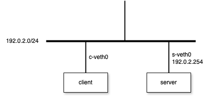

# DHCP(Dynamic Host Configuration Protocol)

## descriptioon

DHCP (Dynamic Host Configuration Protocol) is an application‐layer protocol that automates IP address assignment and network configuration for hosts on a TCP/IP network. It evolved from BOOTP and follows a client–server model:

- Configuration parameters: IP address, subnet mask, default gateway, DNS servers, NTP servers, and custom options
- Ports: UDP 67 (server) and UDP 68 (client)
- Lease‐based assignments: addresses are leased for a defined duration; clients must renew before expiration
- DORA handshake:
  1. DHCPDISCOVER (client → broadcast)
  2. DHCPOFFER (server → client)
  3. DHCPREQUEST (client → server)
  4. DHCPACK (server → client)
- Relay agents: forward DHCP traffic across subnets
- DHCPv6: IPv6 counterpart using UDP ports 547/546, supports stateful and stateless configuration

## example



1. Create Network
```bash
$ sudo ip --all netns delete
$ sudo ip netns add server
$ sudo ip netns add client
$ sudo ip link add s-veth0 type veth peer name c-veth0
$ sudo ip link set s-veth0 netns server
$ sudo ip link set c-veth0 netns client
$ sudo ip netns exec server ip link set s-veth0 up
$ sudo ip netns exec client ip link set c-veth0 up
$ sudo ip netns exec server ip address add 192.0.2.254/24 dev s-veth0
```

2. Launch DHCP Server
```bash
$ sudo ip netns exec server dnsmasq \
--dhcp-range=192.0.2.100,192.0.2.200,255.255.255.0 \
--interface=s-veth0 \
--port 0 \
--no-resolv \
--no-daemon
dnsmasq: started, version 2.90 DNS disabled
dnsmasq: compile time options: IPv6 GNU-getopt DBus no-UBus i18n IDN2 DHCP DHCPv6 no-Lua TFTP conntrack ipset nftset auth cryptohash DNSSEC loop-detect inotify dumpfile
dnsmasq-dhcp: DHCP, IP range 192.0.2.100 -- 192.0.2.200, lease time 1h
```

3. Configure ip address to Client

`client`
```bash
$ sudo ip netns exec client dhclient -d c-veth0
Internet Systems Consortium DHCP Client 4.4.3-P1
Copyright 2004-2022 Internet Systems Consortium.
All rights reserved.
For info, please visit https://www.isc.org/software/dhcp/

Listening on LPF/c-veth0/16:9b:04:7b:98:89
Sending on   LPF/c-veth0/16:9b:04:7b:98:89
Sending on   Socket/fallback
xid: warning: no netdev with useable HWADDR found for seed's uniqueness enforcement
xid: rand init seed (0x68637811) built using gethostid
DHCPDISCOVER on c-veth0 to 255.255.255.255 port 67 interval 3 (xid=0xdc57875)
DHCPDISCOVER on c-veth0 to 255.255.255.255 port 67 interval 5 (xid=0xdc57875)
DHCPOFFER of 192.0.2.105 from 192.0.2.254
DHCPREQUEST for 192.0.2.105 on c-veth0 to 255.255.255.255 port 67 (xid=0x7578c50d)
DHCPACK of 192.0.2.105 from 192.0.2.254 (xid=0xdc57875)
bound to 192.0.2.105 -- renewal in 1707 seconds.
```

`server`
```bash
$ sudo ip netns exec server dnsmasq --dhcp-range=192.0.2.100,192.0.2.200,255.255.255.0 --interface=s-veth0 --port 0 --no-resolv --no-daemon
...

dnsmasq-dhcp: DHCPDISCOVER(s-veth0) 16:9b:04:7b:98:89
dnsmasq-dhcp: DHCPOFFER(s-veth0) 192.0.2.105 16:9b:04:7b:98:89
dnsmasq-dhcp: DHCPDISCOVER(s-veth0) 16:9b:04:7b:98:89
dnsmasq-dhcp: DHCPOFFER(s-veth0) 192.0.2.105 16:9b:04:7b:98:89
dnsmasq-dhcp: DHCPREQUEST(s-veth0) 192.0.2.105 16:9b:04:7b:98:89
dnsmasq-dhcp: DHCPACK(s-veth0) 192.0.2.105 16:9b:04:7b:98:89 raspberrypi-1
```

4. Check client Address and Route
```bash
$ sudo ip netns exec client ip address show | grep "inet"
    inet 192.0.2.105/24 brd 192.0.2.255 scope global dynamic c-veth0
    inet6 fe80::149b:4ff:fe7b:9889/64 scope link

$ sudo ip netns exec client ip route show
default via 192.0.2.254 dev c-veth0
192.0.2.0/24 dev c-veth0 proto kernel scope link src 192.0.2.105
```
