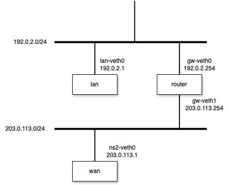
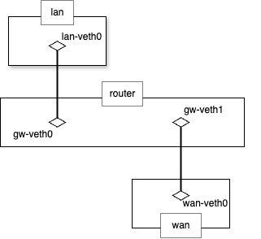

# Source NAT

## description

## example




1. Create Network
```bash
$ sudo ip --all netns delete
$ sudo ip netns show
$ sudo ip netns add lan
$ sudo ip netns add router
$ sudo ip netns add wan
$ sudo ip link add lan-veth0 type veth peer name gw-veth0
$ sudo ip link add wan-veth0 type veth peer name gw-veth1
$ sudo ip link set lan-veth0 netns lan
$ sudo ip link set gw-veth0 netns router
$ sudo ip link set gw-veth1 netns router
$ sudo ip link set wan-veth0 netns wan
$ sudo ip netns exec lan ip link set lan-veth0 up
$ sudo ip netns exec router ip link set gw-veth0 up
$ sudo ip netns exec router ip link set gw-veth1 up
$ sudo ip netns exec wan ip link set wan-veth0 up
$ sudo ip netns exec router ip address add 192.0.2.254/24 dev gw-veth0
$ sudo ip netns exec router ip address add 198.51.100.254/24 dev gw-veth1
$ sudo ip netns exec lan ip address add 192.0.2.1/24 dev lan-veth0
$ sudo ip netns exec lan ip route add default via 192.0.2.254
$ sudo ip netns exec wan ip address add 203.0.113.1/24 dev wan-veth0
$ sudo ip netns exec wan ip route add default via 203.0.113.254
```

2.
