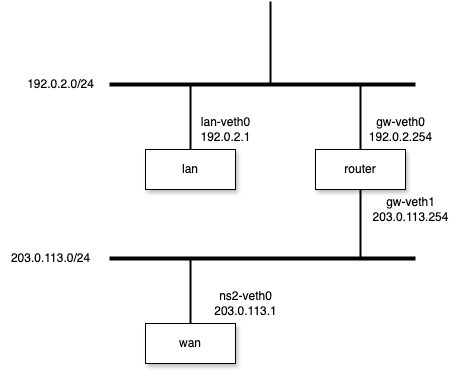

# Source NA(P)T(Network Address Port Translation)

## description

Source NAT (SNAT) is a form of Network Address Translation that rewrites the source IP address (and optionally port) of packets originating from a private network so they can traverse an external network using a public address. It is implemented in the NAT table’s POSTROUTING chain on the gateway or router.

Key points:
- Source rewrite: private → public IP
- Common iptables targets:
  - MASQUERADE – dynamic translation for interfaces with changing IPs (e.g. DHCP WAN links)
  - SNAT – static translation specifying a fixed external IP
- Port Address Translation (PAT) enables multiple hosts to share one public IP by mapping unique source ports
- Ensures return traffic is routed back through the gateway
- Contrast with DNAT, which modifies the destination address for inbound connections

## example




1. Create Network
```bash
$ sudo ip netns add lan
$ sudo ip netns add router
$ sudo ip netns add wan

$ sudo ip link add lan-veth0 type veth peer name gw-veth0
$ sudo ip link add wan-veth0 type veth peer name gw-veth1

$ sudo ip link set lan-veth0 netns lan
$ sudo ip link set gw-veth0 netns router
$ sudo ip link set gw-veth1 netns router
$ sudo ip link set wan-veth0 netns wan

$ sudo ip netns exec lan ip link set lan-veth0 up
$ sudo ip netns exec router ip link set gw-veth0 up
$ sudo ip netns exec router ip link set gw-veth1 up
$ sudo ip netns exec wan ip link set wan-veth0 up

$ sudo ip netns exec router ip address add 192.0.2.254/24 dev gw-veth0
$ sudo ip netns exec router ip address add 203.0.113.254/24 dev gw-veth1
$ sudo ip netns exec lan ip address add 192.0.2.1/24 dev lan-veth0
$ sudo ip netns exec lan ip route add default via 192.0.2.254
$ sudo ip netns exec wan ip address add 203.0.113.1/24 dev wan-veth0
$ sudo ip netns exec wan ip route add default via 203.0.113.254
```

2. Check current NAT Configuration
```bash
$ sudo ip netns exec router iptables -t nat -L
Chain PREROUTING (policy ACCEPT)
target     prot opt source               destination

Chain INPUT (policy ACCEPT)
target     prot opt source               destination

Chain OUTPUT (policy ACCEPT)
target     prot opt source               destination

Chain POSTROUTING (policy ACCEPT)
target     prot opt source               destination
```

3. Add NAT Rules
```bash
$ sudo ip netns exec router iptables -t nat \
-A POSTROUTING \
-s 192.0.2.0/24 \
-o gw-veth1 \
-j MASQUERADE
```

4. Check Again
```bash
$ sudo ip netns exec router iptables -t nat -L
Chain PREROUTING (policy ACCEPT)
target     prot opt source               destination

Chain INPUT (policy ACCEPT)
target     prot opt source               destination

Chain OUTPUT (policy ACCEPT)
target     prot opt source               destination

Chain POSTROUTING (policy ACCEPT)
target     prot opt source               destination
MASQUERADE  all  --  192.0.2.0/24         anywhere
```

5. Ping to `wan` from `lan`

`lan`
```bash
$ sudo ip netns exec lan ping 203.0.113.1
PING 203.0.113.1 (203.0.113.1) 56(84) bytes of data.
64 bytes from 203.0.113.1: icmp_seq=1 ttl=63 time=0.122 ms
64 bytes from 203.0.113.1: icmp_seq=2 ttl=63 time=0.072 ms
64 bytes from 203.0.113.1: icmp_seq=3 ttl=63 time=0.062 ms
...
```

`lan`(tcpdump)
```bash
$ sudo ip netns exec lan tcpdump -tnl -i lan-veth0 icmp
tcpdump: verbose output suppressed, use -v[v]... for full protocol decode
listening on lan-veth0, link-type EN10MB (Ethernet), snapshot length 262144 bytes
IP 192.0.2.1 > 203.0.113.1: ICMP echo request, id 39888, seq 9, length 64
IP 203.0.113.1 > 192.0.2.1: ICMP echo reply, id 39888, seq 9, length 64
IP 192.0.2.1 > 203.0.113.1: ICMP echo request, id 39888, seq 10, length 64
IP 203.0.113.1 > 192.0.2.1: ICMP echo reply, id 39888, seq 10, length 64
IP 192.0.2.1 > 203.0.113.1: ICMP echo request, id 39888, seq 11, length 64
IP 203.0.113.1 > 192.0.2.1: ICMP echo reply, id 39888, seq 11, length 64
...
```

`wan`(tcpdump)
```bash
$ sudo ip netns exec wan tcpdump -tnl -i wan-veth0 icmp
tcpdump: verbose output suppressed, use -v[v]... for full protocol decode
listening on wan-veth0, link-type EN10MB (Ethernet), snapshot length 262144 bytes
IP 203.0.113.254 > 203.0.113.1: ICMP echo request, id 39888, seq 1, length 64
IP 203.0.113.1 > 203.0.113.254: ICMP echo reply, id 39888, seq 1, length 64
IP 203.0.113.254 > 203.0.113.1: ICMP echo request, id 39888, seq 2, length 64
IP 203.0.113.1 > 203.0.113.254: ICMP echo reply, id 39888, seq 2, length 64
IP 203.0.113.254 > 203.0.113.1: ICMP echo request, id 39888, seq 3, length 64
IP 203.0.113.1 > 203.0.113.254: ICMP echo reply, id 39888, seq 3, length 64
...
```
